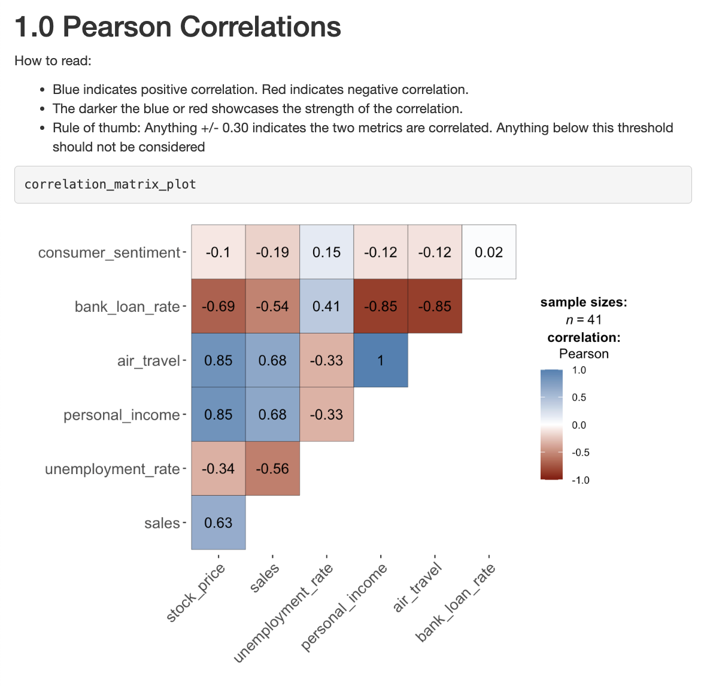
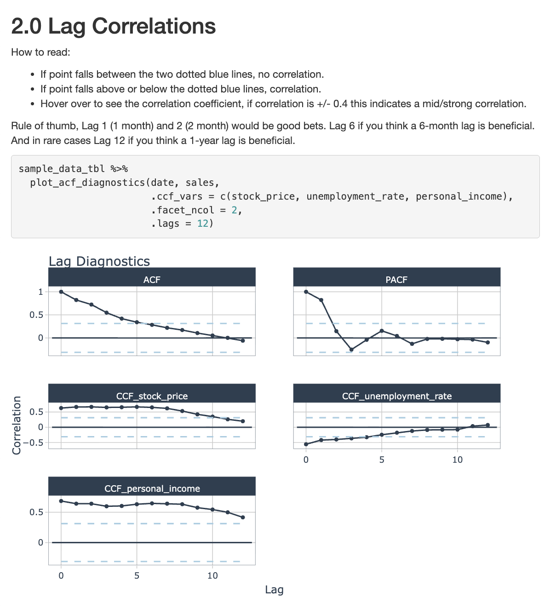
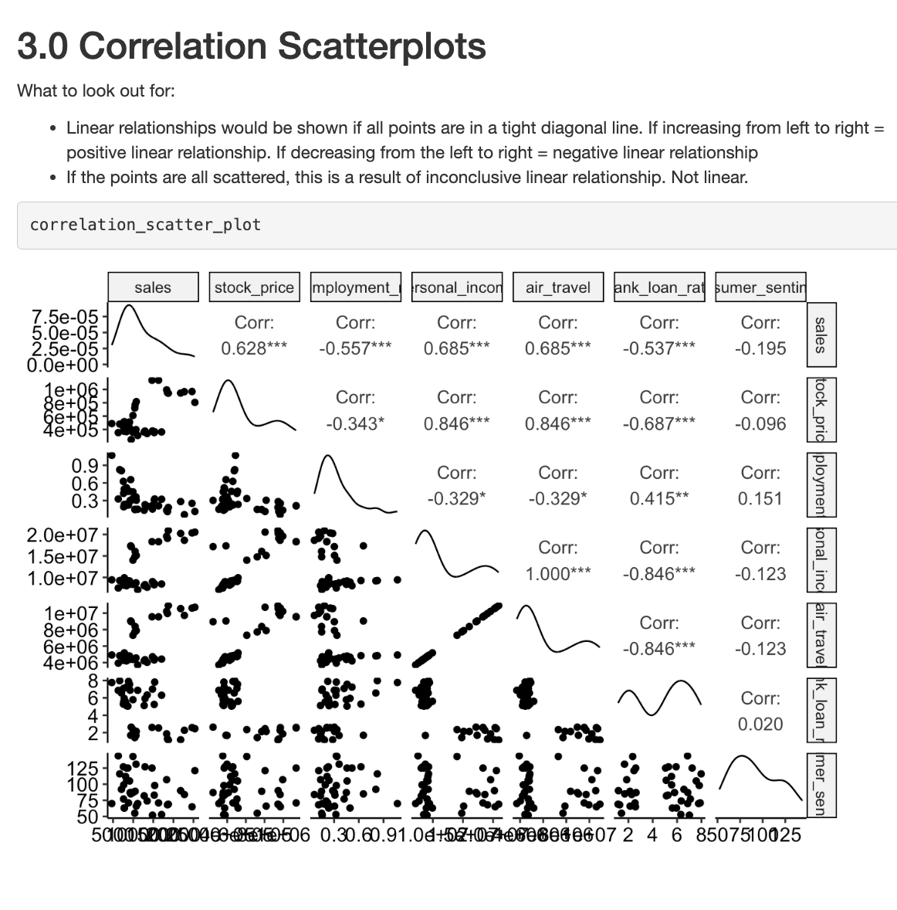
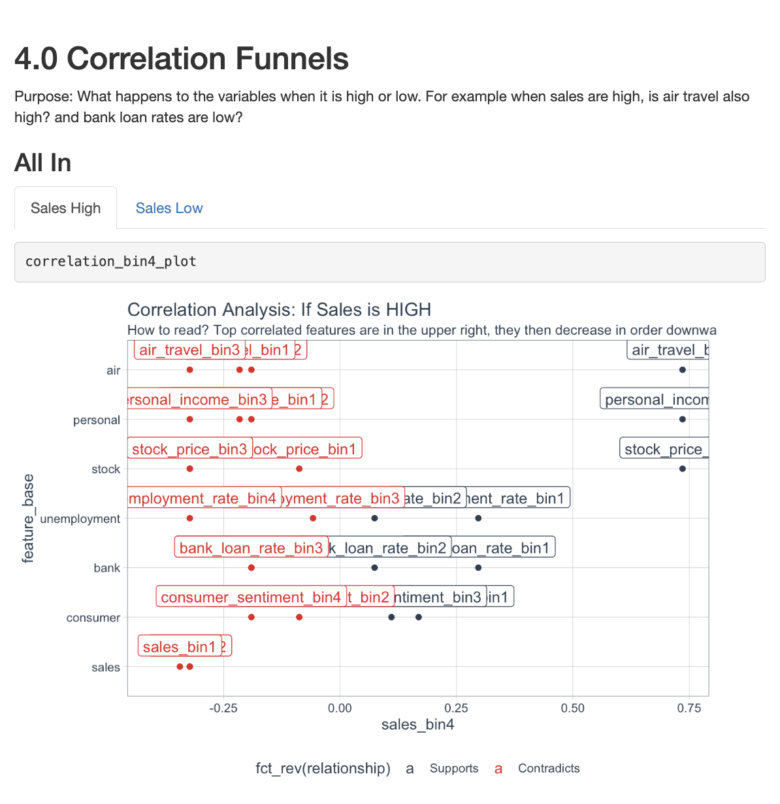

# Quick Correlation Analysis

A lightweight Python utility for rapidly computing and visualizing correlations in tabular datasets. Designed to streamline exploratory data analysis by quickly identifying relationships between variables.

---

## Features

- Fast computation of correlation matrices
- Support for common correlation methods (e.g. Pearson, Spearman)
- Simple workflow for exploratory data analysis
- Optional visualization of correlation heatmaps
- Works with standard tabular datasets (CSV / DataFrame)

---

## Use Case

During exploratory data analysis, it is often useful to quickly identify relationships between variables. This script provides a simple workflow to:

1. Load a dataset
2. Compute correlations across numerical features
3. Visualize or inspect the strongest relationships

This helps identify candidate features for modeling, detect multicollinearity, and uncover interesting patterns in the data.

---

## Installation

Clone the repository:
```
git clone https://github.com/shelly-gsr/quick-correlation-analysis.git
cd quick-correlation-analysis
```

---

## Example Output






---

## Future Improvements

Possible extensions:
- Automatic detection of highly correlated feature pairs
- Support for partial correlations
- Feature clustering based on correlation
- Integration with automated EDA workflows
